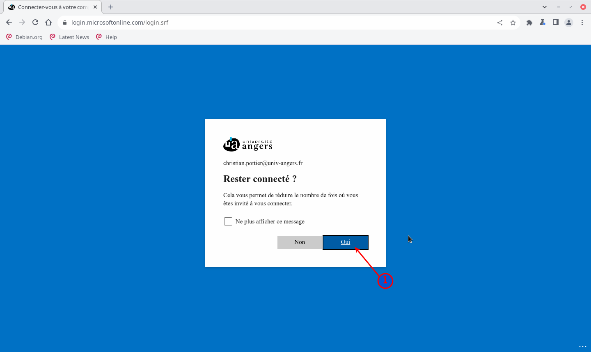

Pour intégrer les applications (PWA) à votre environnement, vous devez choisir un navigateur :

Chromium : Logiciel libre (base du logiciel Chrome) déjà installé.

**OU**

Microsoft Edge :  

* Le plus, meilleur intégration pour les PWA Microsoft.  
* Le moins, Microsoft Edge veut se mettre comme navigateur par défaut.  

# Installation avec le navigateur Microsoft Edge

Si Microsoft Edge n'est pas installé, tapez dans un terminal (copier/coller) :

	curl -sL https://raw.githubusercontent.com/cpunivangers/madeb12/main/playbooks/files/Divers/microsoft-edge-stable.sh | bash

## Lancer Microsoft Edge et se connecter à son compte Office

## Saisir son adresse de courriel {.pagebreakbefore}

## S'authentifier

## Installer l'application Microsoft 365 {.pagebreakbefore}

## Lancer l'application Teams

## Installer l'application Teams {.pagebreakbefore}

## Les applications sont maintenant disponibles dans le menu

## Mettre les applications sur le bureau {.pagebreakbefore}

## Les applications sont maintenant sur le bureau

# Installation avec le navigateur Chromium {.pagebreakbefore}

## Lancer Chromium et se connecter à son compte Office

## Saisir son adresse de courriel

## S'authentifier {.pagebreakbefore}

## Installer l'application Teams {.pagebreakbefore}

  

## Installer de la même manière Microsoft 365 :

